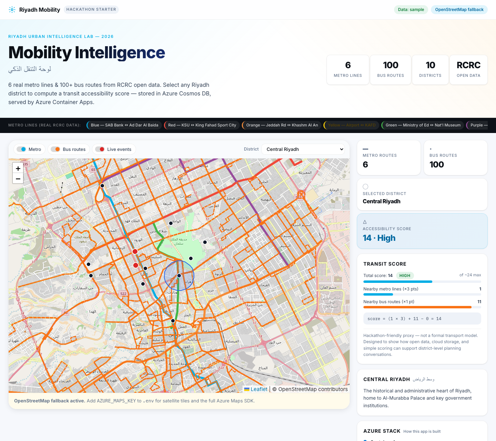
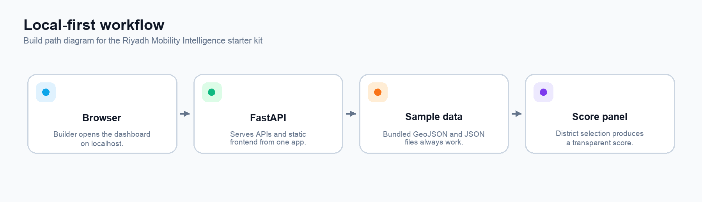
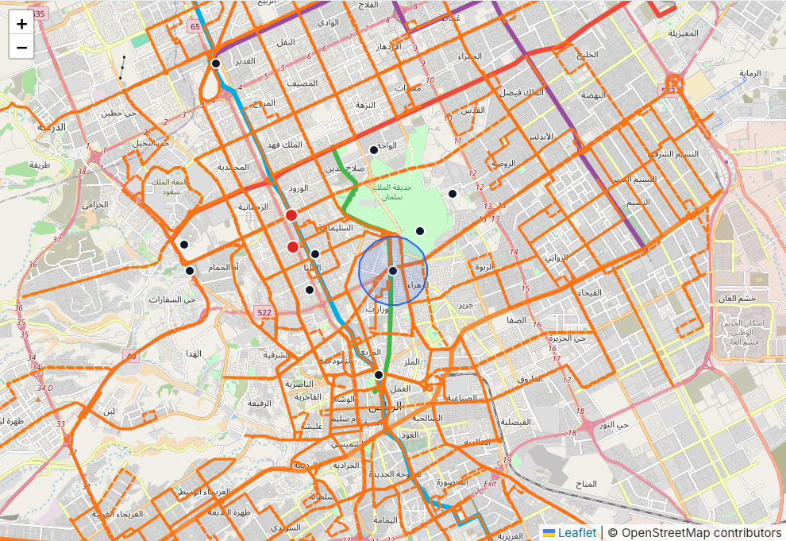
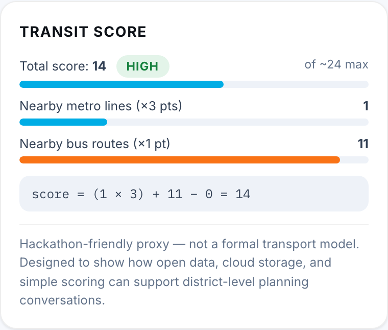

# Riyadh Mobility Dashboard Team Runbook

**atomcamp Arabia and Microsoft Riyadh Urban Hackathon**

This guide is for a mixed team. A manager can lead the session, a runtime owner can run the dashboard on one laptop, a change owner can make small edits, and an Azure owner can handle cloud resources. You do not need to understand the whole codebase before you start.

**Public dashboard:** [Open the deployed application](https://ca-rmd-api-riyadh-ud-ua-aesdq5.jollyplant-57daa6ab.uaenorth.azurecontainerapps.io/)

The local path is the safe starting point. It uses bundled sample data, needs no Azure login, and creates no Azure costs.

{width=6.55in}

*The local dashboard: transport routes, district selection, and a transparent accessibility score.*

<!-- pagebreak -->

## 1 Pick the route and assign people

Start by deciding what the team actually needs. Do not install tools or touch Azure if the goal is only to show the existing dashboard.

| If your goal is | Do this | Stop when |
|---|---|---|
| Show the existing app | Open the public dashboard | The demo is complete |
| Change the app locally | Assign a runtime owner and follow Sections 2–8 | The local checks pass |
| Publish a changed app | Ask the Azure owner to follow Section 10 | The deployed smoke test passes |

Give each job to a named person before anyone starts. One person may fill more than one role on a small team.

| Role | Owns | Does not need to do |
|---|---|---|
| Manager or facilitator | Goal, demo flow, decisions, and handoff notes | Edit code or Azure resources |
| Runtime owner | Installs the local tools, runs the dashboard, and completes checks | Deploy to Azure |
| Change owner | Makes one small code or data change at a time and retests | Approve cloud spending |
| Azure owner | Subscription, resource group, cloud deployment, and cost controls | Change the product story |

Follow this order every time:

1. The manager chooses the route above and names the owners.
2. The runtime owner follows Sections 2–5 until the local dashboard works.
3. The change owner follows Sections 6–8 for one small change.
4. The manager repeats the checks and records the result.
5. Only then does the Azure owner use Section 10.

{width=6.55in}

*The same workflow works locally before any cloud services are introduced.*

**Success in the first 20 minutes:** the dashboard opens at `http://127.0.0.1:8000`; Metro and Bus layers can be toggled; selecting a district updates the score; `/health` returns `{"status":"ok"}`.

**If nobody on the team writes code:** use the public dashboard for the demo, then ask a runtime owner or mentor to perform the local setup. The manager does not need to edit files, install Azure tools, or run cleanup commands.

**Manager fast lane:** if the goal is a demo, open the public dashboard and stop. If local setup fails once, stop repeating commands and send the support note in Section 6.

<!-- pagebreak -->

## 2 Get the computer ready

This section explains the few computer concepts used later. Read it once before copying commands.

### Words you need

| Word | Plain meaning |
|---|---|
| Terminal | The app where you type commands. On macOS it is Terminal; on Windows it is PowerShell. |
| Repository | The project folder downloaded from GitHub. |
| Command | A short instruction typed into the terminal, then confirmed with Enter. |
| Virtual environment | A private project toolbox named `.venv`; it keeps this app’s Python packages separate. |
| Localhost | This laptop. `127.0.0.1:8000` means the browser is talking to the app on this laptop. |

### Install the two required tools

You need Git, Python 3.11 or newer, an internet connection for the one-time download, and a terminal. If the laptop is managed by an organisation, ask IT or the runtime owner to install them.

- [Install Git](https://git-scm.com/downloads)
- [Install Python](https://www.python.org/downloads/)
- Optional plain-text editor: [Visual Studio Code](https://code.visualstudio.com/download)

On Windows, select **Add Python to PATH** in the Python installer if that option appears. After installing, close and reopen PowerShell.

Use a plain-text editor for code and data files. Do not open Python, JSON, or GeoJSON files in Word or Pages.

### Check the tools

**macOS Terminal**

```bash
git --version
python3 --version
```

**Windows PowerShell**

```powershell
git --version
py --version
```

Pass result: both commands print a version number, and Python is 3.11 or newer. If a command is not found, install the missing tool, reopen the terminal, and run the check again.

### Terminal habits that prevent mistakes

1. Copy one command at a time.
2. Paste it into the terminal and press Enter.
3. Wait for it to finish before running the next command.
4. Keep the terminal visible when the server is running; it is the app’s status window.
5. If a command prints a red error, stop and capture the full error before trying random fixes.

**AI Pro Tip:** Ask Copilot or ChatGPT: “Explain this command in plain English, tell me what success looks like, and give me only the next action. Do not change files.” Never paste passwords, keys, or the contents of `.env`.

<!-- pagebreak -->

## 3 Start on macOS

The runtime owner should do these steps in order. The first run downloads Python packages and may take a few minutes.

### Step 1 Open Terminal

Open **Applications → Utilities → Terminal**. A prompt appears. The prompt is where you type; do not type the prompt characters themselves.

### Step 2 Download the project

```bash
git clone https://github.com/Esturban/microsoft-hackathon-riyadh-mobility.git
cd microsoft-hackathon-riyadh-mobility
```

Pass result: the prompt is now inside the project folder. If `cd` says the folder does not exist, run `ls` and check the spelling.

### Step 3 Create the private Python toolbox

```bash
python3 -m venv .venv
source .venv/bin/activate
```

Pass result: `(.venv)` appears at the start of the terminal prompt. You must repeat the `source` command each time you open a new terminal for this project.

### Step 4 Install the app packages

```bash
python -m pip install -r requirements.txt
```

Pass result: the command finishes without a red error. Warnings are usually okay; copy them to the handoff note if the app does not start.

### Step 5 Create the local settings file

```bash
cp .env.example .env
```

The copied file uses `DATA_MODE=sample`. That is the correct setting for a workshop. Do not add Azure keys to this file unless the Azure owner tells you to.

### Step 6 Start the dashboard

```bash
python -m uvicorn app.main:app --reload
```

Pass result: the terminal says `Uvicorn running on http://127.0.0.1:8000`. Leave this terminal open.

### Step 7 Open the browser

Open [http://127.0.0.1:8000](http://127.0.0.1:8000). If the page loads, continue to Section 5. To stop the server, return to Terminal and press `Ctrl+C`.

<!-- pagebreak -->

## 4 Start on Windows

Use **PowerShell**, not the browser address bar. The runtime owner should copy one command at a time.

### Step 1 Open PowerShell

Open the Windows Start menu, search for **PowerShell**, and open it. A blue or black terminal window appears.

### Step 2 Download the project

```powershell
git clone https://github.com/Esturban/microsoft-hackathon-riyadh-mobility.git
cd microsoft-hackathon-riyadh-mobility
```

Pass result: the prompt is now inside the project folder. If `cd` says the folder does not exist, run `dir` and check the spelling.

### Step 3 Create and activate the private Python toolbox

```powershell
py -3 -m venv .venv
.venv\Scripts\Activate.ps1
```

Pass result: `(.venv)` appears at the start of the PowerShell prompt. You must repeat the activation command each time you open a new PowerShell window for this project.

If PowerShell says that running scripts is disabled, run this one-time command for the current window, then activate again:

```powershell
Set-ExecutionPolicy -Scope Process -ExecutionPolicy Bypass
.venv\Scripts\Activate.ps1
```

### Step 4 Install the app packages

```powershell
python -m pip install -r requirements.txt
```

Pass result: the command finishes without a red error. Warnings are usually okay; capture them if the app does not start.

### Step 5 Create the local settings file

```powershell
Copy-Item .env.example .env
```

The copied file uses `DATA_MODE=sample`. Do not add Azure keys to this file unless the Azure owner tells you to.

### Step 6 Start and open the dashboard

```powershell
python -m uvicorn app.main:app --reload
```

Leave the PowerShell window open. Open [http://127.0.0.1:8000](http://127.0.0.1:8000) in a browser. To stop the server, return to PowerShell and press `Ctrl+C`.

<!-- pagebreak -->

## 5 Prove the local app works

Do not change code until these checks pass. A manager can perform the browser checks while the runtime owner watches the terminal.

| Check | What to do | Pass result |
|---|---|---|
| Dashboard | Open `http://127.0.0.1:8000` | Riyadh map and controls appear |
| Map layers | Turn Metro and Bus off, then on | Route overlays disappear and return |
| District score | Choose a district | Rating and explanation update |
| Health | Open `http://127.0.0.1:8000/health` | `{"status":"ok"}` |
| Data source | Open `http://127.0.0.1:8000/api/data-status` | `activeMode` is `sample` |

{width=6.2in}

*The local map remains useful when Azure Maps is not configured because it falls back to OpenStreetMap tiles.*

### What the browser pages mean

- `/health` answers one question: is the API alive?
- `/api/data-status` answers: which data source is active? `sample` is expected locally.
- `/api/districts` lists the districts available to the selector.
- `/api/routes` lists the route summary used by the dashboard.

Use this short demonstration flow:

1. Show the dashboard landing page.
2. Toggle Metro and Bus layers to explain the two transport views.
3. Select a district and read the score explanation.
4. Open `/api/data-status` and explain that sample data keeps the app working without cloud credentials.

<!-- pagebreak -->

## 6 Recover when something goes wrong

Most first-run problems are a missing tool, the wrong folder, an inactive `.venv`, or a server that is not running. Use the first matching row and stop if the fix does not work.

| What you see | First action | If it still fails |
|---|---|---|
| `command not found` or `not recognized` | Install the named tool, reopen the terminal, and rerun the version check | Ask IT or the runtime owner |
| `destination path already exists` during `git clone` | Run `ls` or `dir`, then `cd` into the existing project folder | Ask the runtime owner before cloning a second copy |
| `No such file or directory` after `cd` | Run `ls` on macOS or `dir` on Windows and check the folder name | Re-run the `git clone` step in a known folder |
| `ModuleNotFoundError` | Activate `.venv`, then rerun `python -m pip install -r requirements.txt` | Capture the full error |
| Browser says it cannot connect | Check that the Uvicorn terminal is still open and use port 8000 | Restart the server |
| `Address already in use` | Run `python -m uvicorn app.main:app --reload --port 8001` and open port 8001 | Tell the manager which port you used |
| PowerShell blocks `Activate.ps1` | Run the process-scoped policy command in Section 4 | Ask the runtime owner; do not change organisation-wide policy |
| Map is blank | Set `AZURE_MAPS_KEY=` in `.env`, save, and restart | Check whether the OpenStreetMap fallback appears |
| A code or data edit breaks the page | Stop the server and undo only the last edit in the editor | Ask the change owner to review the diff |
| A cloud command asks for a subscription or deletes resources | Stop immediately | Give the command and full output to the Azure owner |

### The support note to send

When asking for help, send these five lines. Do not send passwords, keys, or the contents of `.env`.

```text
Computer: macOS or Windows
Step I was on:
Command I ran:
What I expected:
What actually happened and the full error:
```

**AI Pro Tip:** Paste only the support note into Copilot or ChatGPT and ask: “I am new to Python. Identify the likely cause, give me one safe next step, and tell me what result to expect.” If the first fix fails, stop and ask the runtime owner.

<!-- pagebreak -->

## 7 Make one safe change

Make only one change at a time. Keep the local app working before and after the change. Do not deploy a change that has not passed the local checks.

{width=3.3in}

*The score is intentionally transparent so teams can discuss and adapt the rule.*

### First change the score weighting

1. Stop the server with `Ctrl+C`.
2. Open `app/scoring.py` in a text editor.
3. Find this line:

   ```python
   score = (nearby_metro_count * 3) + nearby_bus_count - live_delay_penalty
   ```

4. Change only the `3` if you want metro access to count more or less. For example, change it to `2`.
5. Save the file.
6. Start the server again and select a district.
7. Repeat every check in Section 5.

### Record the change

```bash
git diff -- app/scoring.py
python -m pytest
```

Pass result: the diff shows only the intended line and the tests pass. If the result is wrong, undo the last edit in the text editor, save, and repeat Section 5.

### Rules for a first change

- Change one file, not five files.
- Do not change `.env` to a cloud mode.
- Do not paste secret values into a document or chat.
- Do not ask the Azure owner to deploy until the manager has seen the local result.

**AI Pro Tip:** Before editing, ask Copilot: “Explain this scoring line in plain English and show a small example.” After editing, ask: “Review this diff for accidental changes; do not rewrite it.” A human still decides whether the change matches the workshop goal.

<!-- pagebreak -->

## 8 Change sample data safely

Sample data is the workshop safety net. It lives in `app/static/sample-data/` and keeps the app useful without cloud credentials.

| File | Contains | Beginner guidance |
|---|---|---|
| `riyadh_metro_lines_sample.geojson` | Six metro line features | Ask a technical reviewer before changing geometry |
| `riyadh_bus_routes_sample.geojson` | Bus route features | Preserve valid GeoJSON structure |
| `district_centers_sample.geojson` | Ten district points and names | Change one district record at a time |
| `mock_live_events_sample.json` | Example delay or incident markers | Keep the JSON commas and quotes valid |

### Safe data workflow

1. In Finder or File Explorer, duplicate the original file and put the copy outside the project folder.
2. Change one record in the sample file.
3. Save the file.
4. Run the validator:

   ```bash
   python scripts/validate_data.py
   ```

5. Start the local server and repeat Section 5.
6. Run the tests:

   ```bash
   python -m pytest
   ```

7. Show the changed file and the command results to the manager.

If validation fails, stop. The error names the file or property that needs review. Do not switch to `blob`, `cosmos`, or `auto` to hide a sample-data problem.

### Files technical owners may need

| Goal | Start here |
|---|---|
| Run the app | `app/main.py` |
| Change the API | `app/routes.py` |
| Change data fallback | `app/data_access.py` |
| Change the score | `app/scoring.py` |
| Change page or map interaction | `app/static/index.html` and `app/static/src/` |
| Replace sample data | `app/static/sample-data/` |
| Review Azure infrastructure | `azure.yaml` and `infra/` |

<!-- pagebreak -->

## 9 Run the demo and hand off

The manager can lead this section without opening the code editor.

### Five minute demo

1. Open the public dashboard or the verified local URL.
2. Introduce the Riyadh map and the Metro and Bus layers.
3. Select one district and explain that the score is a transparent workshop proxy, not a formal transport model.
4. Open `/api/data-status` and show that the local demo uses bundled sample data.
5. If the team changed anything, show the one changed file and the passing checks.

### Names and ownership

Write these down before the session ends.

| Role | Name | Last confirmed |
|---|---|---|
| Manager or facilitator | ____________________ | ____________________ |
| Runtime owner | ____________________ | ____________________ |
| Change owner | ____________________ | ____________________ |
| Azure owner | ____________________ | ____________________ |

### Handoff checklist

- Last successful local URL and the computer used.
- Date and time of the last successful run.
- `DATA_MODE` value in `.env` (`sample` for workshops).
- Changed files and the result of `python -m pytest` plus `python scripts/validate_data.py`.
- Public URL, target subscription, resource group, region, and cost owner if Azure is in use.
- The full support note if a check failed.

<!-- pagebreak -->

## 10 Azure owner only

This is the only section that can create billable cloud resources. A beginner should not run it alone. If the team only needs a demo, stop at Section 9.

### Current shared deployment

The verified public dashboard is running on the **Riyadh Urban Hackathon** subscription. The target resource group is `rg-riyadh-ud-uae-north` in **UAE North**. The Bicep deployment keeps Azure Maps global; its account is `maps-riyadh-mobility-riyadh-ud-uae-north`. The West US 2 source group has been decommissioned after the replacement health and data-status checks passed.

```text
https://ca-rmd-api-riyadh-ud-ua-aesdq5.jollyplant-57daa6ab.uaenorth.azurecontainerapps.io/
```

Its health endpoint is:

```text
https://ca-rmd-api-riyadh-ud-ua-aesdq5.jollyplant-57daa6ab.uaenorth.azurecontainerapps.io/health
```

Use the public dashboard for sharing and the local dashboard for making changes safely.

### Before deployment

1. Confirm the local checks in Section 5 pass.
2. Confirm the target subscription is **Riyadh Urban Hackathon**.
3. Confirm the target resource group and region with the budget owner.
4. Confirm that the person running the commands has the required Azure role.
5. Record the expected deployment owner and teardown date.

```bash
az login
azd auth login
az account set --subscription "Riyadh Urban Hackathon"
az account show --output table
azd env select riyadh-ud-uae-north
azd env get-values
```

Stop if `az account show` displays the wrong subscription or if the resource group is not the agreed target.

**AI Pro Tip:** AI can translate Azure CLI output into plain language. Ask: “Compare this account output with the target subscription and resource group. Tell me what looks wrong; do not run commands.” The Azure owner must make the decision and approve every deploy or teardown action.

### Deploy and verify

```bash
bash scripts/deploy_azure.sh uaenorth rg-riyadh-ud-uae-north
```

After deployment, open the URL printed as `WEB_APP_URL`, then check:

- the dashboard loads;
- `/health` returns `{"status":"ok"}`;
- `/api/data-status` shows the intended active mode;
- the Azure owner records the URL and deployment time.

Do not create duplicate resource groups just to retry a failed deployment. Do not run a cleanup or destroy command from a beginner laptop. Teardown belongs to the Azure owner and budget owner; use `docs/azure_deployment.md` for the controlled process.

<!-- pagebreak -->

## Appendix Command cheat sheet and help

### Start again later

**macOS**

```bash
cd microsoft-hackathon-riyadh-mobility
source .venv/bin/activate
python -m uvicorn app.main:app --reload
```

**Windows PowerShell**

```powershell
cd microsoft-hackathon-riyadh-mobility
.venv\Scripts\Activate.ps1
python -m uvicorn app.main:app --reload
```

### Stop the local server

Return to the terminal that shows Uvicorn and press `Ctrl+C`. Closing the browser does not stop the server; closing the terminal does.

### Run the two project checks

```bash
python -m pytest
python scripts/validate_data.py
```

### What not to do

- Do not put secrets in the repository or the runbook.
- Do not change cloud settings while trying to fix a local sample-data problem.
- Do not delete a resource group to solve a code error.
- Do not deploy until the local browser checks pass.
- Do not report success based only on a command finishing; open the URL and check the result.

### Safe AI prompts

| Need | Prompt to copy |
|---|---|
| Understand a command | “Explain this command for a non-technical manager. What does it change, and what should I see if it worked?” |
| Understand an error | “Here is the red error text. Give me one safe next step and the expected result. Do not suggest deleting files or cloud resources.” |
| Understand a code change | “Explain this diff in plain English. List any unintended changes. Do not rewrite the code.” |
| Prepare a handoff | “Turn these non-secret test results into a five-line handoff note with owner, URL, change, checks, and next action.” |

AI is a reading and explanation aid. It is not the approval path for Azure subscriptions, deployments, secrets, or resource deletion.

### Where to look next

Use `docs/local_setup.md` for the short technical setup, `docs/troubleshooting.md` for deeper diagnostics, `docs/azure_deployment.md` for controlled cloud operations, and `docs/data_sources.md` for data provenance.
